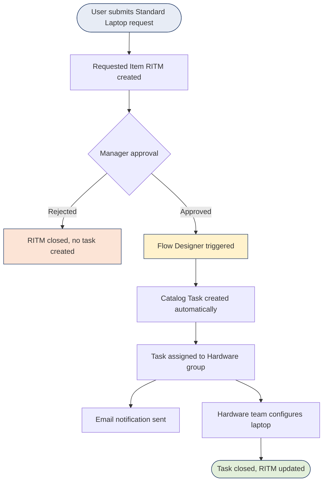
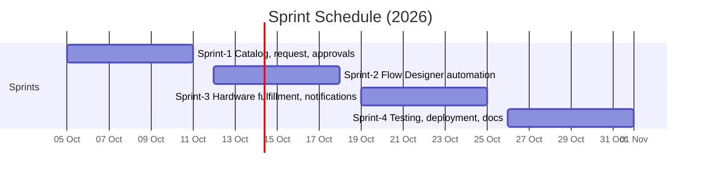

# Streamlining-IT-Procurement
The Standard Laptop Procurement Automation project is a ServiceNow solution designed to streamline the IT hardware procurement process using Flow Designer. The project automates the creation of a Catalog Task when a Standard Laptop request is approved and assigns the task to the Hardware team for configuration.

# Standard Laptop Procurement Automation

A ServiceNow solution that uses **Flow Designer** to automatically create a **Catalog Task** and assign it to the **Hardware team** as soon as a Standard Laptop request is approved.


**Team ID:** `6aba11b55015c35b98631d18`

---

## Table of Contents

- [Overview](#overview)
- [Problem Statement](#problem-statement)
- [Solution](#solution)
- [Workflow](#workflow)
- [Architecture](#architecture)
- [Technology Stack](#technology-stack)
- [Project Planning](#project-planning)
- [Repository Structure](#repository-structure)
- [Setup](#setup)
- [Benefits](#benefits)
- [Team](#team)

---

## Overview

Approved Standard Laptop requests often need someone to manually create and assign a hardware configuration task. This project removes that step. Once a request is approved, the platform creates the Catalog Task and assigns it to the Hardware team without human intervention.

**ServiceNow components used:** Service Catalog, Requested Items (RITM), Approvals, Flow Designer, Catalog Tasks.

## Problem Statement

> IT requesters and Hardware team members need a faster and more consistent way to process approved Standard Laptop requests, because manual Catalog Task creation and assignment can cause delays, errors, and poor task visibility.

| Persona | Pain point |
|---|---|
| **IT requester** | Unsure of the status and processing time of the laptop request after approval |
| **Hardware team member** | Has to wait for someone to manually create and assign the task before starting work |

**Key problems identified**

- Manual creation of Catalog Tasks
- Manual assignment to the Hardware team
- Delays after approval
- Human errors and inconsistent assignment
- Limited task visibility

## Solution

An **approval-based Flow Designer flow** that connects the request, approval and task steps:

1. The user submits a Standard Laptop request through the Service Catalog.
2. A Requested Item is created and sent for approval.
3. When the request is **approved**, the flow triggers.
4. A Catalog Task is created automatically.
5. The task is assigned to the **Hardware group**.
6. The Hardware team configures the laptop and closes the task.

If the request is rejected, no task is created.

## Workflow



## Architecture

All logic runs inside a single ServiceNow cloud instance. There are no external APIs and no machine learning models.


| Layer | Component |
|---|---|
| User interface | Service Portal (request form), task queue (Hardware team) |
| Request handling | Service Catalog item with variables, Requested Item |
| Approval | Manager approval (approve / reject) |
| Automation | Flow Designer: trigger, condition (Approved), Create Catalog Task, assign to group |
| Data | ServiceNow tables: `sc_req_item`, `sc_task`, `sysapproval_approver`, `sys_user_group` |
| Notifications | Email to requester and Hardware team |

Full document: [`docs/Technology_Stack_Laptop_Procurement.pdf`](docs/Technology_Stack_Laptop_Procurement.pdf)

## Technology Stack

| Component | Technology |
|---|---|
| Platform | ServiceNow (cloud instance) |
| Automation | Flow Designer |
| Front end | Service Portal (HTML, CSS, JavaScript, AngularJS widgets) |
| Database | ServiceNow platform database |
| Notifications | ServiceNow email notifications |
| Deployment | Update set between instances |
| Security | ACLs, roles and groups, HTTPS/TLS |

## Project Planning

Agile delivery in **4 sprints** of 6 days each (20 story points per sprint, 80 total).



| Sprint | Focus | Points |
|---|---|---|
| Sprint-1 | Service Catalog item, request submission, approvals | 20 |
| Sprint-2 | Flow Designer: trigger, condition, create and assign Catalog Task | 20 |
| Sprint-3 | Hardware team fulfillment, notifications, rejection handling | 20 |
| Sprint-4 | End-to-end testing, deployment (update set), documentation | 20 |

**Average velocity:** 20 points / 6 days ≈ **3.33 story points per day**

Full backlog, tracker and burndown: [`docs/Project_Planning_Laptop_Procurement.pdf`](docs/Project_Planning_Laptop_Procurement.pdf)

## Repository Structure

```
.
├── README.md
├── images/
│   └── architecture.png
├── docs/
│   ├── Standard_Laptop_Procurement_Automation_Problem_Statements.pdf   # Ideation: problem statements
│   ├── Standard_Laptop_Procurement_Automation_PS.pdf                   # Brainstorm and idea prioritization
│   ├── Technology_Stack_Laptop_Procurement.pdf                         # Architecture and stack
│   └── Project_Planning_Laptop_Procurement.pdf                         # Backlog, sprints, velocity, burndown
└── update-set/                                                          # Exported ServiceNow update set
```

## Setup

1. Get a ServiceNow instance (for example a free Personal Developer Instance).
2. Import the update set from `update-set/` via **System Update Sets > Retrieve Update Set > Preview > Commit**.
3. Confirm a **Hardware** group exists in **User Administration > Groups**.
4. Open **Flow Designer** and make sure the flow is **Active**.
5. Submit a Standard Laptop request from the Service Portal and approve it.
6. Check **Service Catalog > Catalog Tasks**: a new task should appear, assigned to the Hardware group.

## Benefits

- No manual task creation or assignment
- Faster start of laptop configuration
- Fewer human errors
- Consistent processing of every approved request
- Better task visibility for the Hardware team

## Team

**Team ID:** `6aba11b55015c35b98631d18`

| Name | Role |
|---|---|
| _Add name_ | _Add role_ |

---

*Built on ServiceNow: Service Catalog · Requested Items · Approvals · Flow Designer · Catalog Tasks*
